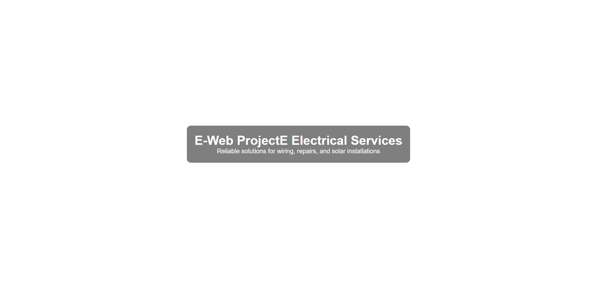
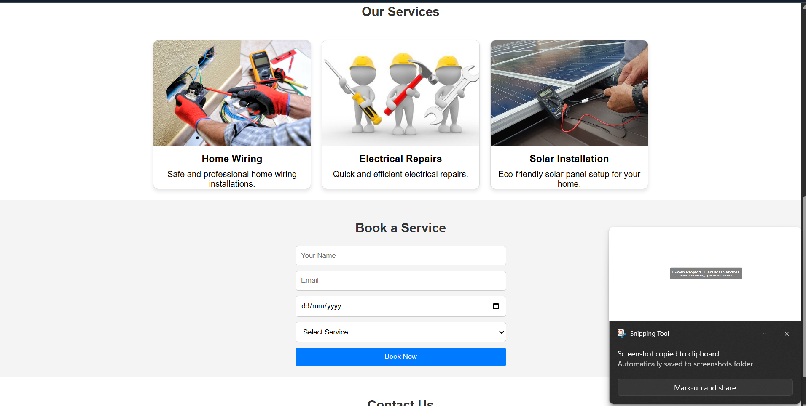

# ⚡ E-Web Project

A responsive electrician business website developed using HTML and CSS. The website showcases electrical services, home wiring solutions, repair services, and solar installation with a clean and modern interface.

---

## 🚀 Features

- Responsive Design
- Home Page
- Services Section
- Contact Section
- Image Gallery
- Modern UI

---

## 🛠 Technologies

- HTML5
- CSS3

---

## 📂 Project Structure

```text
E-Web-Project/
│
├── index.html
├── style.css
├── assets/images/
├── screenshots/
└── README.md
```

---

## 📸 Screenshots

### Home Page



### Services



---

## ▶ Live Demo

GitHub Pages Link Here

---

## 👨‍💻 Author

Shivarjun Chaturvedi
